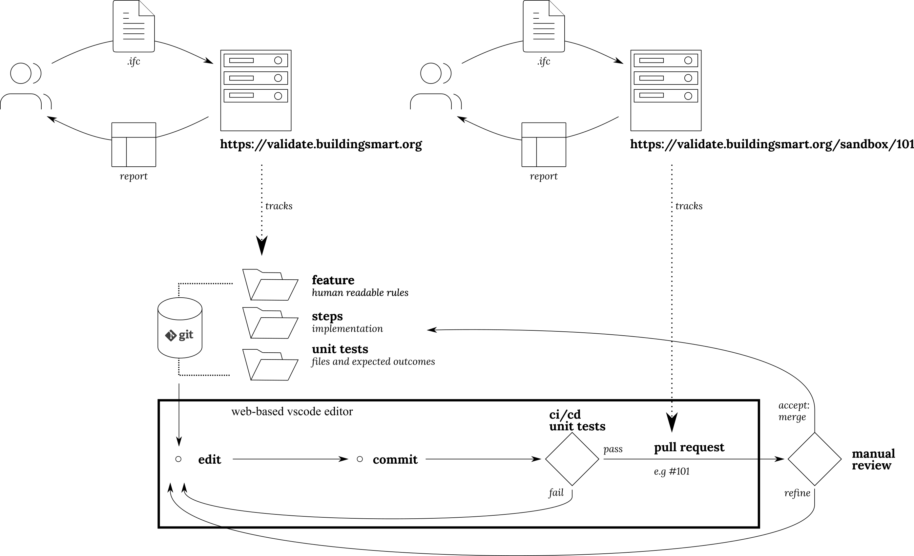

# IFC Gherkin rules

## Usage as part of buildingSMART validation service

### Overview

The workflow presented below is currently being developed, where a Pull Request to this repository (which is a submodule in https://github.com/buildingSMART/validate) will result in a novel "sandbox" URL being constructed, where end-users can try out the aumented body of rules.

### Making changes

The rules developed in this repository follow the general ideas of Gherkin and its python implementation behave.

This means there are human readable definitions of rules and Python implementations.

A third component of this repository are minimal sample files with expected outcomes, which means that extensions and modifications can be suggested with confidence of not breaking existing functionality.

#### Advised workflow

https://github.dev/AECgeeks/ifc-gherkin-rules

(to be continued)

## Command line usage

Informal propositions and implementer agreements written in Gherkin for automatic validation of IFC building models using steps implemented in IfcOpenShell.

~~~
$ python -m ifc-gherkin-rules ifc-gherkin-rules\test\files\cube-advanced-brep.ifc
Feature: Shell geometry propositions/IfcClosedShell.v1
    URL: /blob/8dbd61e/features/geometry.shells.feature

   Step: Every oriented edge shall be referenced exactly 1 times by the loops of the face

       * #29=IfcClosedShell((#104,#115,#131,#147,#163,#179))
         On instance #29=IfcClosedShell((#104,...,#179)) the edge (-0.183012701892219,
         0.683012701892219, 1.0) -> (-0.683012701892219, -0.183012701892219, 1.0) was
         referenced 2 times

       * #29=IfcClosedShell((#104,#115,#131,#147,#163,#179))
         On instance #29=IfcClosedShell((#104,...,#179)) the edge (-0.5, -0.5, 0.0) ->
         (-0.5, 0.5, 0.0) was referenced 2 times

       * #29=IfcClosedShell((#104,#115,#131,#147,#163,#179))
         On instance #29=IfcClosedShell((#104,...,#179)) the edge (-0.5, 0.5, 0.0) ->
         (0.5, 0.5, 0.0) was referenced 2 times

       * #29=IfcClosedShell((#104,#115,#131,#147,#163,#179))
         On instance #29=IfcClosedShell((#104,...,#179)) the edge (-0.683012701892219,
         -0.183012701892219, 1.0) -> (0.183012701892219, -0.683012701892219, 1.0) was
         referenced 2 times

       * #29=IfcClosedShell((#104,#115,#131,#147,#163,#179))
         On instance #29=IfcClosedShell((#104,...,#179)) the edge (0.183012701892219,
         -0.683012701892219, 1.0) -> (0.683012701892219, 0.183012701892219, 1.0) was
         referenced 2 times

       * #29=IfcClosedShell((#104,#115,#131,#147,#163,#179))
         On instance #29=IfcClosedShell((#104,...,#179)) the edge (0.5, -0.5, 0.0) ->
         (-0.5, -0.5, 0.0) was referenced 2 times

       * #29=IfcClosedShell((#104,#115,#131,#147,#163,#179))
         On instance #29=IfcClosedShell((#104,...,#179)) the edge (0.5, 0.5, 0.0) ->
         (0.5, -0.5, 0.0) was referenced 2 times

       * #29=IfcClosedShell((#104,#115,#131,#147,#163,#179))
         On instance #29=IfcClosedShell((#104,...,#179)) the edge (0.683012701892219,
         0.183012701892219, 1.0) -> (-0.183012701892219, 0.683012701892219, 1.0) was
         referenced 2 times
~~~
