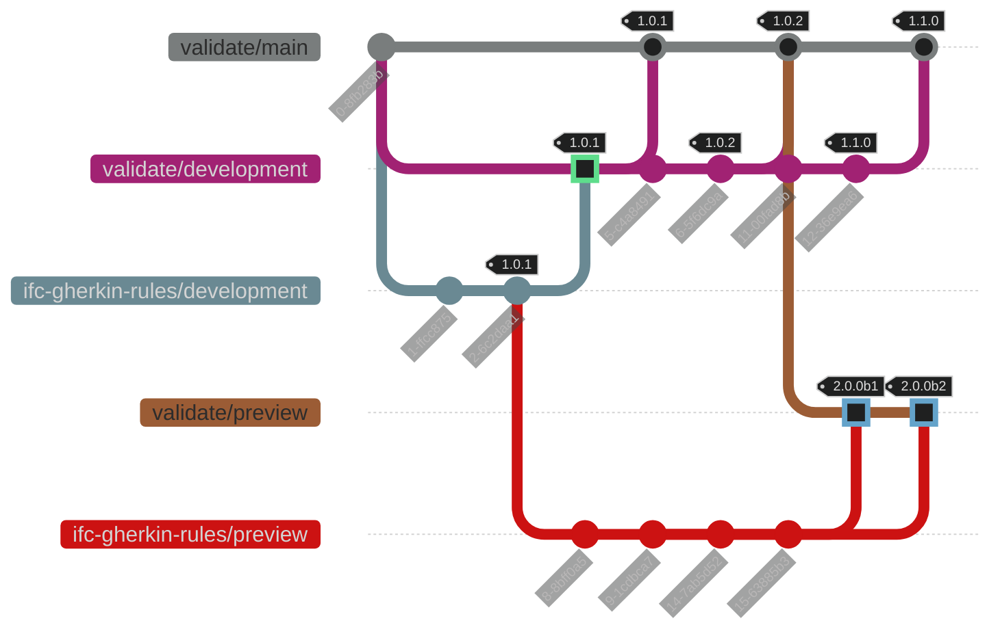

# Adapt platform to annual release policy (IVS-822)

## Background

This document is intended as a design document for the changes needed to accommodate the annual release policy.
More specifically, the release of v1.0.0 and exiting beta means that changes and additions to the rules
will need to be firewalled from the production environment that is being used to populate scorecards.

## Release policy

These are the steps involved and business rules, with rough timelines.

1. exit beta, 1.0.0 released Q1 2026
2. no new rules or rule fixes for version 1 that affect vendors seeking scorecard-based certification
   - Warnings raised by Industry Best Practice (IBP) rules are not included in the assessment of a specific vendor tool version 
   - Therefore new IBP rules may be released under the 1.0 major version label when deemed appropriate by the product manager
3. other performance improvements, UI adjustments are ok as they do not affect scorecard-based assessment
4. new rules and rule fixes continue "behind the scenes"
5. these new rules are available on a limited, invitation-only basis for beta testing
   - v2.0.0-b1
   - v2.0.0-b2
   - v2.0.0-b3
   - ...
6. Q4 2026 - rule freeze and change from beta to release candidate v2.0.0-rc1
7. Q1 2027 - rule fixes only
   - v2.0.0-rc2
   - v2.0.0-rc3
   - ...
8. End of Q1 2027 - release of 2.0.0 to PROD environment

## Repositories, submodules, and environments

Submodules will continue to be utilized as they have in the past -
namely with `buildingSMART/validate` as the primary repository and
`buildingSMART/ifc-data-model` and `buildingSMART/ifc-gherkin-rules` as submodules.

Of these two submodules, only `buildingSMART/ifc-gherkin-rules` will be affected by
the adaption of the platform.
A new branch named `preview` will be created in both `validate` and `ifc-gherkin-rules`.

Note: this branch in `validate` will merely be used to point at a specific (different) commit in the
`ifc-gherkin-rules` submodule.
All other content will track the `validate/development` branch.

### Environments

There are currently two environments, DEV and PROD.
These two environment will continue as they have in the past.
A new environment PREVIEW will be spun up (instance sizes and capacities to match DEV)
and will go-live with new rules as they are developed.

#### Correlation to branch names

| Name     | Deploys from branch      | Notes                                   |
|----------|--------------------------|-----------------------------------------|
| PROD     | validate\/main           | 1.x releases until Q1 2027              |
| DEV      | validate\/development    | unchanged from beta phase               |
| PREVIEW  | validate\/preview        | new rules and rule fixes (v.2.0)        |

### Branching Strategy

_Note: square symbols indicate an update to a submodule reference, not a merge._

## Rule Catalog Documentation

The Github Workflow [pages-build-deployment](https://github.com/buildingSMART/ifc-gherkin-rules/actions/workflows/pages/pages-build-deployment)
generates documentation of all rules and gherkin step implementations.
This documentation is then deployed to branch-specific URLS, e.g.

[https://buildingsmart.github.io/ifc-gherkin-rules/branches/main/features/index.html]

and

[https://buildingsmart.github.io/ifc-gherkin-rules/branches/development/features/index.html]

and

[https://buildingsmart.github.io/ifc-gherkin-rules/branches/development/features/index.html]

Therefore this Github action does not require any changes to accommodate the new `preview` branch
or any other adaptations to the platform to support the rules freeze.
