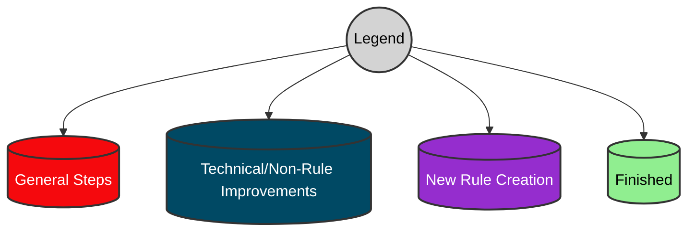
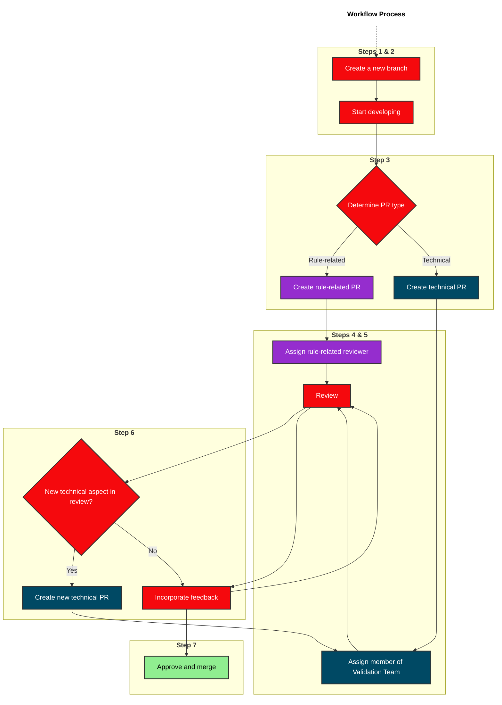
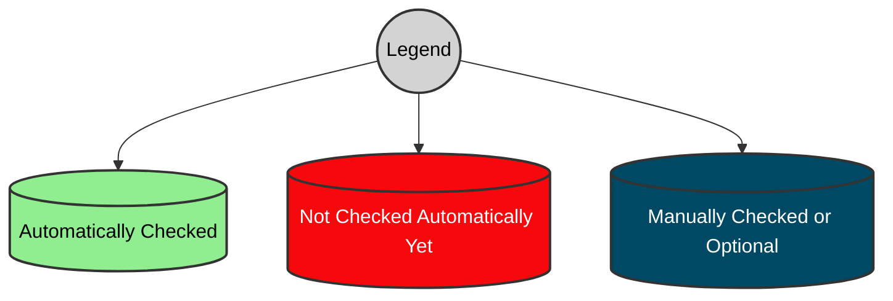
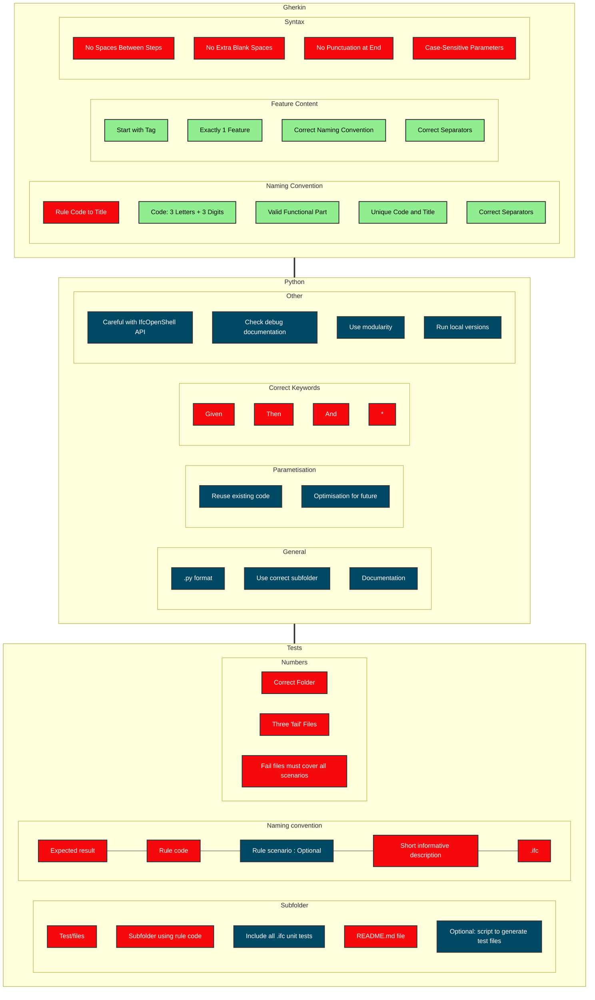

# Ryle creation instructions 
This comprehensive guide will walk you through the entire process, ensuring you have all the tools necessary to effectivly create and implement a new rule. 

## Table of Contents

- [Workflow](#worfklow)
- [Branch Creation](#1-branch-creation)
- [Rule Development](#2-rule-development)
  - [Feature Files (gherkin rules) for IFC](#21-write-feature-files-gherkin-rules-for-ifc)
  - [Python Steps](#22-write-python-steps)
  - [Unit Test Files](#23-write-unit-test-files)
- [Assign a Reviewer to the Pull Request](#4-assign-a-reviewer-to-the-pull-request)
- [Review the Pull Request](#5-review-the-pull-request)

## Workflow





The process of rule creation can be compartmentalized into seven distinct phases, meant to be tackled in sequential order. However, it's important to note the following caveat. When the proposed enhancements don't directly pertain to the rule under development, please create a 'non-rule' or 'technical' pull request.

The rationale behind this is twofold. First, it allows for pull requests to be at a managable size. Second, it accelerates the rule implementation process by decoupling rule development from unrelated improvements. This seperation can be initiated either at the outset of creating a new branch or during the review phase where a reviewer may opt to split the pull requests 
branch

The approval or improvement suggestion of the pull request will be then based exclusively on the primary objective of the pull request. In the case of rule-related requests, the criteria would center on whether the rule is correctly formulated and whether the gathered data accurately mirrors this formulation.

On the other hand, the evaluation of a technical or non-rule pull request could be more varied, allthough it is often based on its integration level with the existing codebase and whether optimal or reusable design patterns or tools have been employed.This approach both maintains code cinstensy but also improves efficiency and reusability in the long run.

| | Step                                                                                     | Responsible                 |
|----|------------------------------------------------------------------------------------------|-----------------------------|
| 1  | Create a new branch                              | bSI Validation Service team |
| 2  | Start developing  **following instructions below**        | rule developer              |
| 3  | Create a pull request              |
| 4  | Assign a reviewer to the pull request   | rule developer              |
| 5  | Review the pull request                                                                  | bSI Validation Service team |
| 6  | (Optional) Fix the rule according to feedback                             | rule developer              |
| 7  | Approve and merge                                                    | bSI Validation Service team |


## 1. Create a new branch

In the buildingSMART [GitHub repository containing all rules](https://github.com/buildingSMART/ifc-gherkin-rules), create the branch that will be used to develop the new rule.

- Give the branch a meaningful name
- Add 1 rule per branch, to facilitate review (1 rule = 1 `.feature` file)
- Add technical improvements / code restructure / small commits into new pull request(s)

## 2. Rule development

A rule is considered complete when it has:

- a Gherkin [**feature file**](#21-write-feature-files-gherkin-rules-for-ifc)
- corresponding python implementation (aka, [**python steps**](#22-write-python-steps))
- a set of [**unit test files**](#23-write-unit-test-files)

The following provds a concise summary of all the checks, procedures and hints;  for example, the use of correct naming, extentioins and folders. This has grown into a substantial list over time. To streamline this process, certain elements are checked automatically; these are highlighted in green.

There are also elements, designated in blue, that either require a manual check or are optional. Lastly, some components demand manual verification because an automated check has not yet been implemented. Contributions to automate these manual checks are encouraged and would be a good example of a 'non-rule' pull-request.







### 2.1) Gherkin
A feature file is a file, written using Gherkin syntax, describing the rule behavior.
In the branch just created, add a Gherkin feature file following these instructions.

**File format**: `.feature`

**Location**: https://github.com/buildingSMART/ifc-gherkin-rules/tree/main/features

---
#### Naming convention for feature files
---
- The file name is 'rule code -> rule title' 
- The rule code is made of 3 digits capital letters (taken from the list of [Functional parts](./Functional-parts.md)) + 3 digits number
- The rule code, and rule title, must be unique
- The rule title shall have no space and shall use `-` as separator

<details><summary>wrong</summary>

```
SPS001 - Basic-spatial-structure-for-buildings.feature
SPS001_Basic spatial structure for buildings.feature
SPS001 - Basic spatial structure for buildings.feature
```
</details>
<details><summary>right</summary>

```
SPS001_Basic-spatial-structure-for-buildings.feature
```
</details>

---
#### Content of .feature files
---

- must start with a tag to the functional part. See [Functional parts](./Functional-parts.md)
- must include exactly 1 Feature
- the naming convention for the Feature is the following: rule code - rule title (the same used for the file name). For the rule title blank spaces must be used instead of `-` 

<details><summary>wrong</summary>

```
Feature: ALB001_Alignment Layout

Given ...
Then ...
```
```
@ALB
Feature: ALB001_Alignment-Layout

Given ...
Then ...
```
```
@ALB
Feature: ALB001 - Alignment-Layout

Given ...
Then ...
```

</details>
<details><summary>right</summary>

```
@ALB
Feature: ALB001 - Alignment Layout

Given ...
Then ...
```
</details>

 - must include **a description of the rule** that start with "The rule verifies that..." 

<details><summary>examples</summary>

```
@implementer-agreement
@ALB
Feature: ALB003 - Allowed entities nested in Alignment
The rule verifies that an Alignment has a nesting relationship with its components (i.e., Horizontal, Vertical, Cant layouts) or with Referents (e.g., mileage markers). And not with any other entity.

  Scenario: Agreement on nested elements of IfcAlignment
  Given ...
  Then ...
```
</details>

-  Mandatory Given(s): If the rule in the feature file applies only to specific IFC version(s) and/or View Definition(s), then the feature file (or each of its Scenarios, if it has more than one) must start with Given steps specifying the applicability of the following steps

<details><summary>examples</summary>

```
Given A file with Schema Identifier "IFC2X3"
And A file with Model View Definition "CoordinationView"
```
```
Given A file with Schema Identifier "IFC2X3" or "IFC4"
And A file with Model View Definition "CoordinationView" or "ReferenceView"
```
</details>

- Optional content: 
`.feature` files:
- can include 1 or more Scenarios
- Scenario titles have no constraints

---
#### Syntax
---
- No spaces in between steps
<details><summary>wrong</summary>

```
Given a file with Schema Identifier "IFC4X3"

Then Each IfcAlignmentHorizontal must be nested only by 1 IfcAlignment
And Each IfcAlignmentVertical must be nested only by 1 IfcAlignment
And Each IfcAlignmentCant must be nested only by 1 IfcAlignment
```
</details>
<details><summary>right</summary>

```
Given a file with Schema Identifier "IFC4X3"
Then Each IfcAlignmentHorizontal must be nested only by 1 IfcAlignment
And Each IfcAlignmentVertical must be nested only by 1 IfcAlignment
And Each IfcAlignmentCant must be nested only by 1 IfcAlignment
```
</details>

- Watch out for extra blank spaces

<details><summary>wrong</summary>

```
Given a file with Schema Identifier "IFC4X3"
Then Each IfcAlignmentHorizontal must be nested only by 1 IfcAlignment
And  Each IfcAlignmentVertical must be nested only by 1 IfcAlignment
And  Each IfcAlignmentCant must be nested only by 1 IfcAlignment
```
</details>
<details><summary>right</summary>

```
Given a file with Schema Identifier "IFC4X3"
Then Each IfcAlignmentHorizontal must be nested only by 1 IfcAlignment
And Each IfcAlignmentVertical must be nested only by 1 IfcAlignment
And Each IfcAlignmentCant must be nested only by 1 IfcAlignment
```
</details>

-  Do not use punctuation at the end of the steps

<details><summary>wrong</summary>

```
Given a file with Schema Identifier "IFC4X3",
Then Each IfcAlignmentHorizontal must be nested only by 1 IfcAlignment;
And Each IfcAlignmentVertical must be nested only by 1 IfcAlignment;
And Each IfcAlignmentCant must be nested only by 1 IfcAlignment.
```
</details>
<details><summary>right</summary>

```
Given a file with Schema Identifier "IFC4X3"
Then Each IfcAlignmentHorizontal must be nested only by 1 IfcAlignment
And Each IfcAlignmentVertical must be nested only by 1 IfcAlignment
And Each IfcAlignmentCant must be nested only by 1 IfcAlignment
```
</details>

- Be careful when typing parameters. They are case sensitive!

<details><summary>wrong</summary>

```
Given a file with Schema Identifier "IFC4x3",
```
</details>
<details><summary>right</summary>

```
Given a file with Schema Identifier "IFC4X3"
```
</details>

- Must vs Shall: 
Use **must**, not **shall** to impose requirements.
"Shall" is ambiguous, also in the legal field the community is moving to a strong preference for “must” as the clearest way to express a requirement or obligation.

<details><summary>wrong</summary>

```
Given A file with Schema Identifier "IFC2X3"
And A file with Model View Definition "CoordinationView"
Then There must be exactly 1 IfcSite element(s)
```
</details>
<details><summary>right</summary>

```
Given A file with Schema Identifier "IFC2X3"
And A file with Model View Definition "CoordinationView"
Then There must be exactly 1 IfcSite element(s)
```
</details>

- Correct verbs for IFC relationships: 
when a rule requires a specific IFC relationship to exist, refer to the table below for the right verb to be used.

| IFC relationship       | Verb for rules        | Examples                                                           |
|------------------------|-----------------------|--------------------------------------------------------------------|
| IfcRelAggregates       | aggregate, aggregates | Then IfcSite must aggregate IfcBuilding                            |
| IfcRelNests            | nest, nests           | Then Each IfcAlignmentVertical nests a list of IfcAlignmentSegment |
| ...                    |                       |


### 2.2) Python implementation
---
#### General
---
The Python steps serve as a practical execution of the Gherkin grammar that we've defined in the feature files. To modify or add Python implementation of steps, simply navigate to the same branch where your Gherkin rules are housed. Then, proceed according to the following guidelines..

- **File format**: `.py`

- Use correct subfolder: **Location**: https://github.com/buildingSMART/ifc-gherkin-rules/tree/main/features/steps .
 
 


The Python code is organized into distinct subfolders, each acting as seperate packages. These include 'given', 'then', 'utils', and 'errors'. The 'given' and 'then' packages represent the Python implementation of Gherkin steps, while 'utils' houses helper functions. The 'errors' package is, as the name implies, dedicated to handling errors.

These packages are further divided into different modules. For example, 'then' houses modules like 'nesting(.py), values and relationships. It is recommended to utilize the appropriate modules when adding or modifying code. However, the procedure for segmenting code into seperate packages isn't always clear. Some may argue tha the current structure isn't optimal or that(for example), 'nesting' is a subtype of 'relationships. 

Of course, feel free to add improvements on the structure. This would again be a good example of 'non-rule' pull requests

- Documentation

For every new function, please include some docstrings. These should comprise one or two sentences capturing your current understanding of the function. What seems clear today may not be as understandable tomorrow, or to someone else.


---
#### Parametisation
---
For the moment, all python steps are contained in [steps.py](https://github.com/buildingSMART/ifc-gherkin-rules/blob/main/features/steps/steps.py). Therefore, **you should not create a new python file, just expand the existing one.**

---
#### Steps parametrisation
---
When creating a new step, think about parametrisation and optimisation of the step for future uses.

- Reuse existing code: Before creating a new step, check if something similar already exist.
- Try to optimize code for future use. Try to reuse existing steps.


---
#### Correct Keywords
---
The "when" keyword must not be used.
Allowed keywords :
- `Given`
- `Then`
- `And `
- `*`

---
#### Other
---
- Try not to use existing IfcOpenShells API
- Check debug documentation

A good method for debugging is using Visual Studio Code, though the following should work fine with other editors. An effective method is to execute Behave while passing one the 'fail' files as an argument. This technique allows for setting breakpoints within the code, thereby helping identifying and rectifying issues efficiently. Below is a suggested format for the launch file, which needs to be modified with the local path.

```json
{
    // Use IntelliSense to learn about possible attributes.
    // Hover to view descriptions of existing attributes.
    // For more information, visit: https://go.microsoft.com/fwlink/?linkid=830387
    "version": "0.2.0",
    "configurations": [
        {
            "name": "Python: module",
            "type": "python",
            "request": "launch",
            "module": "behave",
            "justMyCode": true,
            "args": ["-D","input='/home/geert/Documents/validation_service/buildingSMART/gherkin/alb002/ifc-gherkin-rules/test/files/alb002/fail-alb002-scenario02-two_alignments.ifc'"]
        }
    ]
}
```
---
- Modularity. 
---
To avoid merge conflicts, it is optimal to design your code to be as loosely coupled or modular as possible. This approach makes code maintainance and understanding easier, as each module functions independently and has a specific role ('seperation of concerns'). It simplifies debugging, testing and reduces potential mege conflicts, as each module can be examined without affecting others. Additionaly, this also makes it easier to split pull requests into smaller, more managable chuncks.

---
- Run local versions
---
The 'sandbox' functionality enables you to run local versions of the validation service. With each pull request, a sandbox link is automatically generated, allowing you to preview the functionality.

Alternatively, if there are updates required in the validation service, you can opt to run the service locally. Here are the steps to do so (with the validation_service repository):
- When on linux, on ui/package.json, modify 'scripts'
``` json
  "scripts": {
    "start": "set NODE_ENV=development && react-scripts start",
    "build": "react-scripts build",
    "test": "react-scripts test",
    "eject": "react-scripts eject",
    "api": "cd ../application && run_no_debug.bat"
  },
  ```
- Create a local environment (for instance, with conda or venv) with the relevant packages. These packages. The most recent version can be found in application/dockerfile.
```docker
RUN /pypy3.8-v7.3.7-linux64/bin/python3 -m pip install --upgrade pip
RUN /pypy3.8-v7.3.7-linux64/bin/python3 -m pip install lark-parser==0.12.0

RUN python3 -m pip install --upgrade pip


RUN python3 -m pip install 'flask>=2.3' flask-cors numpy gunicorn rq redis SQLAlchemy==1.4.31 psycopg2 psycopg2cffi sqlalchemy-utils Flask-BasicAuth flasgger requests pyparsing XlsxWriter requests_oauthlib Authlib requests argparse behave pytest orjson --upgrade
```
- Set environment with ``export environment=development``
- In the ui folder, run ``npm install``
- Update the submodule ``git submodule init && git submodule update``
- Run the local environment : ``npm install``
Note that the gherkin repository is one of these submodules. The flask works as a backend API for reactJS frontend. The gherkin repository is a part of this API.


### 2.3) Write unit test files 
Unit test files are atomic IFC files, created to develop a rule and test its behavior.
In the same branch used for the Gherkin rules, and python steps, create unit test files following these instructions. **IMPORTANT**: every rule developed must have a set of unit test files.

---
#### Subfolder
---
- **File format**: `.ifc`
- **Location**: https://github.com/buildingSMART/ifc-gherkin-rules/tree/main/test/files
- In the 'test/files' directory, make a new subdirectory named after the rule code you're working with (for instance, 'ALB001') and add the set of files for unit tests for that rule in this subfolder.
- Add a README markdown file with a summary of the unit tests, their expected behavior and the tested scope. Using the [template table](#table-template-for-unit-test-files) below
- An option is to generate IFC files for unit tests automatically with (for instance) IfcOpenShell. 

---
#### Naming convention for unit test files files
---
Unit test files must follow this naming convention

`Expected result`-`rule code`-`rule scenario`-`short_informative_description`.ifc

Or in case where a rule has no scenarios
`Expected result`-`rule code`-`short_informative_description`.ifc

<details><summary>Examples</summary>

```
pass-alb001-short_informative_description.ifc
fail-alb001-scenario01-short_informative_description.ifc
fail-alb001-short_informative_description.ifc
```
</details>


---
#### Numbers
---
- Each rule developed must have a set of unit test files
- There must be at least one 'pass' file and two 'fail' files for testing.
- Files must cover all scnearios of a rule

---
#### Table template for unit test files
---
Example table describing unit test expected results

| File name                                             | Expected result | Error log                                                                        | Description                                                                      |
|-------------------------------------------------------|-----------------|----------------------------------------------------------------------------------|----------------------------------------------------------------------------------|
| pass-alb002-alignment-layout                          | success         | n.a.                                                                             |                                                                                  |
| fail-alb002-scenario01-nested_attributes_IfcAlignment | fail            | The instance IfcAlignment is nesting two instances of IfcAlignmentHorizontal ... | Error is descriptive or exactly the error in pytest? If exactly, multiple row... |
| fail-alb002-scenario02-two_alignments                 | fail            | The following 2 instances were encountered: IfcAlignment #23, IfcAlignment #906  | For IfcAlignmentHorizontal, IfcAlignmentVertical and IfcAlignmentCant            |
| fail-alb002-scenario03-layout                   | fail            | The instance #906=IfcAlignment is nesting #907=IfcWall                           | Includes errors for scenario 2                                                   |
| fail-alb002-scenario04-alignment_segments             | fail            | The instance (s) #28=IfcAlignmentHorizontal is assigned to #906=IfcWall          | @todo IfcAlignmentVertical, IfcAlignmentCant. As well as empty list/typo's?      |


## 4. Assign a reviewer to the pull request

### Assigning a reviewer
Once the development is complete, a reviewer should be assigned to the pull request. The criteria for rule-based pull requests are stricter. For non-rule or technical pull requests, any member of the Validation Service Team can be assigned to review and merge the pull request.

### Handling Pull Requests
Pull requests can be split into multiple smaller ones. Developers are encouraged to apply principles such as 'Loose Coupling' and 'Modularity' to avoid conflicts with other code or open pull requests.

### Developer Responsibilities
The developer is responsible for managing their own pull request. This includes:

- Assigning a reviewer
- Agreeing on a review deadline
- Opening issues
- Resolving any merge conflicts
- Incorporating feedback to improve the code

### Reviewer Responsibilities
The reviewer, on the other hand, is tasked with providing timely and constructive feedback.

### Technical or non-rule related 'follow up' pull requests
The responsibility for any technical or non-rule related pull requests that stem from the reviewed pull request falls to either the reviewer or the developer. Unless otherwise specified, the individual who opens the new pull request assumes the same responsibilities as the developer involved in the original pull request. 

### Oversight by the Validation Team
A member of the Validation Team (GH?) oversees the entire repository. Their duties include moderating issues, ensuring minimal overlap between pull requests, and establishing review priorities to ensure the most beneficial sequence of pull requests being reviewed.


## 5. Review the pull request
Keep the review process as focused as possible. If a pull request pertains to a rule, the reviewer should primarily scrutinize the quality of that rule. If associated but non-critical parts of the code could be enhanced, it should not be a sufficient reason to withhold merging the pull request. However, if addressing such an issue proves problematic or significantly beneficial, a new 'non-rule' or technical pull request should be created. Examples of such scenarios from the past include:
- Using 'pyparsing' for custom parsing (technical)
- Adding features to test specific code (non-rule)
- Reorganizing files into seperate packages and modules.

## 6. (Optional) Fix the rule according to feedback from reviewer
After the review process, there might be feedback and suggestions from the reviewers to improve the rule or fix any issues. It could also be that additional pull requests are opened.

- If you have questions, ask the reviewer for clarification.
- Update the rule as suggested.
- If a new technical or non-rule related pull request is opened, check the responsibility for tracking and timely reviews for that pull request. By default, the individual who opened the pull request claims responsibility.
- Update the pull request with a comment detailing the changes made in response to the feedback.
- Request another review from the same reviewer or a different one if needed.

## 7. Approve and merge the pull request
Once everything has been approved and tested, delete the branch. Lastly, celebrate the implementation of the new rule or improvements that have been made :)
