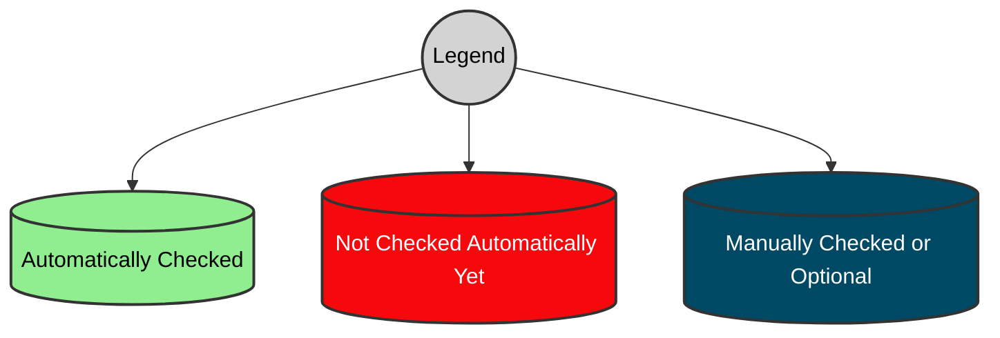
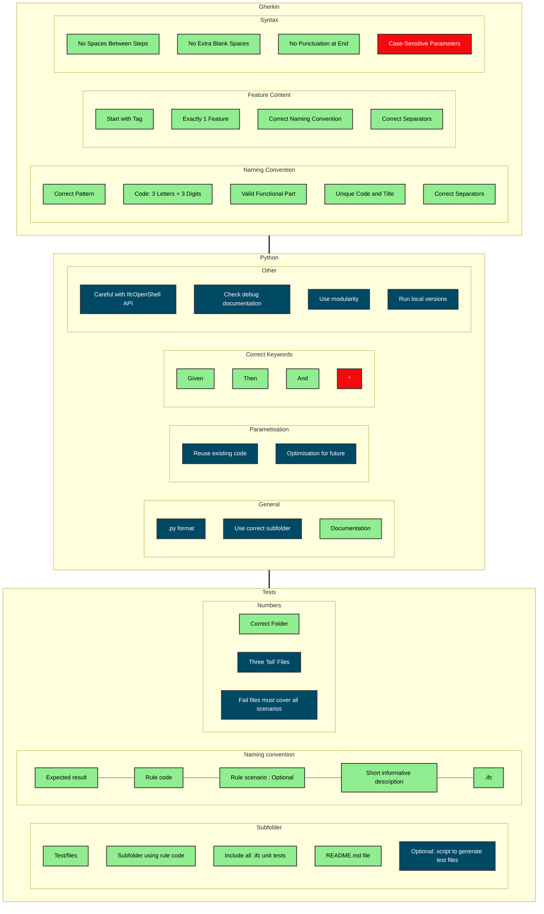

# Enforce Protocol

Enforces rule-conventions described in.
https://github.com/buildingSMART/ifc-gherkin-rules/blob/main/features/README.md

Perhaps a better name would be 'validate_protocol'? 

## Main.py

To allow behave results passing over, the results are modified to pass a dictionary. 
'Display_results' passes the results that is used to generate the error message, like before. `'Convention_check_attrs'` is a dictionary that is used for this protocol check. This dictionary includes variables as: 

 - Tags [@ALB, @implementer-agreement, @disabled]
 - Feature name ('ALB123 - Alignment rule')
 - Feature file ('ALB123_Alignment-rule.feature')
 - Description ('This rule verfies that IfcAlignment nests X')

These variables can be used to check the protocol.

## Test_main.py

Entrypoint is in this file. Due to the command `--validate-dev` with pytest, e.g. `pytest -sv --validate-dev`. This command can also be used to debug the code. 
For running with the Github CI/CD, this command is added in ci.yml.

To allow for this custom argument in pytest, 'conftest.py' is added. 

The dictionary that was added in main.py is parsed with `step_attrs_to_file` for each result for that file and used as an argument in `protocol.enforce`. 
The solution here could be simpler, since, especially when considering that the description of the .feature file remains consistent across all results. Nonetheless, this pattern makes it possible to enforce rule-specific conventions in the (near) future.
Lastly, `ifc_filename`is added. 

## Protocol.py

In the `enforce` function, a dictionary from `test.main.py` is utilized to construct another dictionary named `feature_obj`, which in turn is used to create a Pydantic object. This facilitates the automatic validation of conventions for various variables, such as `feature`, `dotfeature_file`, `description`, and `tags`, based on the arguments provided during the initialization of the Pydantic class. Particularily useful in our case, Pydantic offers the `model_validator` and `field_validator` decorators. The former validates a subset or all of the arguments, while the latter focuses on a single argument passed.

    RuleCreationConventions(**feature_obj)

For the features ifc_input, tags and description, the validation happens directly in the RuleCreationConvention pydantic class through field validators. For instance, at the `@field_validator('description')` tag, which tags whether the description is correct. 

The feature name ('ALB123 - Alignment Rule') and .dotfeature file ('ALB123-alignment-rule), as well as the test ifc file in the (near) future, are validated with another pydantic class `Naming`, since they are all similar: 

 - The rule-code needs to be validated (ALB12, AL123 are not correct). `@field_validator('rule_code')`
 - The seperator(s) need to be validated; `@field_validator('first_separator')`and `@field_validator('separators')`
 - They need to be unique (WIP) -> duplicate.registry.py
 
 Each name need to be parsed before they can be validated, therefore the `@model_validator(mode='before')`is called first. In case there is no parsed_value (e.g. no feature name given), an error will be raised. 

## Validator_helper.py

This file and utils.py offer some helper functions, perhaps they can be merged. The file is mainly used for parsing, and returning error messages in some cases when the parsing is not executed correctly. In this case, when these functions are called by the `@field_validator` it potentially returns an error message which can be used when raising an error. The following instance variables of the pydantic `Naming` have a default value that gets modified after initialization.

    rule_code: typing.Optional[dict] = Field(default_factory=dict, parsed_value=True)
    first_separator: str = Field(" ", parsed_value=True)
    rule_title: str = Field(" ", parsed_value=True)
    separators: typing.Optional[list] = Field(default_factory=list, parsed_value=True)

## Config.py

Initialized a base pydantic class that ensures validation when an instance of a class is modified. In our case, this is when data is parsed and returned to the instance variable

## Duplicate_Registry.py

To save values in between iterations of testfiles. This is to check for uniqueness of rule_codes, as an example. Still WIP, might change to another data storage solution. 

## Errors.py

Stores a custom error message template `ProtocolError`. This way, the rule-creator can easily see where to look for an error when failing pytest. 
Nobody likes pedantic errors, even less so vague pedantic errors.

## Debugger in vscode
launch.json (type:python)

    {
    "version": "0.2.0",
    "configurations": [
    {
    "name": "pytest -sv",
    "type": "python",
    "request": "launch",
    "module": "pytest",
    "args": [
    "-sv", "--validate-dev"
    ],
    "console": "integratedTerminal",
    "justMyCode": false
    }
    ]
    }

## Which errors are checked

The following graph can be used as reference for the protocol validation. In blue are the conventions that are currently validated. In yellow the one that are not checked but (in my opinion) can be validated automatically. The red ones are the ones that are difficult to automatize, or conventions that are not agreed upon yet.

@todo It's not up-to-date. An idea is to perhaps make a system to update this automatically (naming the error in the ProtocolError class and sending this to the markdown). I'm not sure yet. 

