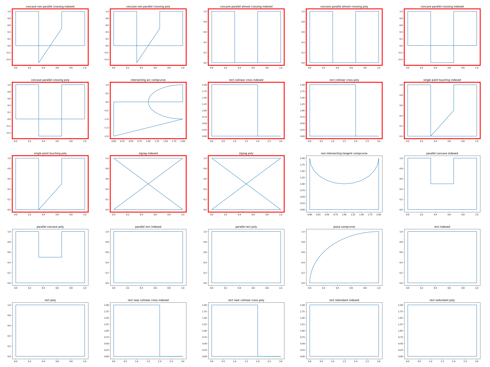

| File name | Expected result | Description |
| --- | --- | --- |
| pass-swe001-IfcArbitraryClosedProfileDef-non\_intersecting\_tangent-compcurve.ifc | pass | Result 1: {'Instance\_id': '', 'Expected': '', 'Observed': ''} |
| pass-swe001-IfcArbitraryClosedProfileDef-rect\_redundant-poly.ifc | pass | Result 1: {'Instance\_id': '', 'Expected': '', 'Observed': ''} |
| pass-swe001-IfcArbitraryClosedProfileDef-parallel\_concave-poly.ifc | pass | Result 1: {'Instance\_id': '', 'Expected': '', 'Observed': ''} |
| pass-swe001-IfcArbitraryClosedProfileDef-parallel\_rect-indexed.ifc | pass | Result 1: {'Instance\_id': '', 'Expected': '', 'Observed': ''} |
| pass-swe001-IfcArbitraryClosedProfileDef-parallel\_rect-poly.ifc | pass | Result 1: {'Instance\_id': '', 'Expected': '', 'Observed': ''} |
| pass-swe001-IfcArbitraryClosedProfileDef-parallel\_concave-indexed.ifc | pass | Result 1: {'Instance\_id': '', 'Expected': '', 'Observed': ''} |
| pass-swe001-IfcArbitraryClosedProfileDef-rect-indexed.ifc | pass | Result 1: {'Instance\_id': '', 'Expected': '', 'Observed': ''} |
| pass-swe001-IfcArbitraryClosedProfileDef-pizza-compcurve.ifc | pass | Result 1: {'Instance\_id': '', 'Expected': '', 'Observed': ''} |
| pass-swe001-IfcArbitraryClosedProfileDef-rect-poly.ifc | pass | Result 1: {'Instance\_id': '', 'Expected': '', 'Observed': ''} |
| pass-swe001-IfcArbitraryClosedProfileDef-rect\_near\_colinear\_cross-indexed.ifc | pass | Result 1: {'Instance\_id': '', 'Expected': '', 'Observed': ''} |
| pass-swe001-IfcArbitraryClosedProfileDef-rect\_near\_colinear\_cross-poly.ifc | pass | Result 1: {'Instance\_id': '', 'Expected': '', 'Observed': ''} |
| pass-swe001-IfcArbitraryClosedProfileDef-rect\_redundant-indexed.ifc | pass | Result 1: {'Instance\_id': '', 'Expected': '', 'Observed': ''} |
| fail-swe001-IfcArbitraryClosedProfileDef-concave\_parallel\_crossing-poly.ifc | fail | Result 1: {'Instance\_id': '', 'Expected': '', 'Observed': ''} |
| fail-swe001-IfcArbitraryClosedProfileDef-zigzag-indexed.ifc | fail | Result 1: {'Instance\_id': '', 'Expected': '', 'Observed': ''} |
| fail-swe001-IfcArbitraryClosedProfileDef-concave\_non\_parallel\_crossing-poly.ifc | fail | Result 1: {'Instance\_id': '', 'Expected': '', 'Observed': ''} |
| fail-swe001-IfcArbitraryClosedProfileDef-concave\_parallel\_almost\_crossing-indexed.ifc | fail | Result 1: {'Instance\_id': '', 'Expected': '', 'Observed': ''} |
| fail-swe001-IfcArbitraryClosedProfileDef-concave\_parallel\_almost\_crossing-poly.ifc | fail | Result 1: {'Instance\_id': '', 'Expected': '', 'Observed': ''} |
| fail-swe001-IfcArbitraryClosedProfileDef-concave\_parallel\_crossing-indexed.ifc | fail | Result 1: {'Instance\_id': '', 'Expected': '', 'Observed': ''} |
| fail-swe001-IfcArbitraryClosedProfileDef-intersecting\_arc-compcurve.ifc | fail | Result 1: {'Instance\_id': '', 'Expected': '', 'Observed': ''} |
| fail-swe001-IfcArbitraryClosedProfileDef-concave\_non\_parallel\_crossing-indexed.ifc | fail | Result 1: {'Instance\_id': '', 'Expected': '', 'Observed': ''} |
| fail-swe001-IfcArbitraryClosedProfileDef-rect\_colinear\_cross-indexed.ifc | fail | Result 1: {'Instance\_id': '', 'Expected': '', 'Observed': ''} |
| fail-swe001-IfcArbitraryClosedProfileDef-rect\_colinear\_cross-poly.ifc | fail | Result 1: {'Instance\_id': '', 'Expected': '', 'Observed': ''} |
| fail-swe001-IfcArbitraryClosedProfileDef-single\_point\_touching-indexed.ifc | fail | Result 1: {'Instance\_id': '', 'Expected': '', 'Observed': ''} |
| fail-swe001-IfcArbitraryClosedProfileDef-single\_point\_touching-poly.ifc | fail | Result 1: {'Instance\_id': '', 'Expected': '', 'Observed': ''} |
| fail-swe001-IfcArbitraryClosedProfileDef-zigzag-poly.ifc | fail | Result 1: {'Instance\_id': '', 'Expected': '', 'Observed': ''} |

